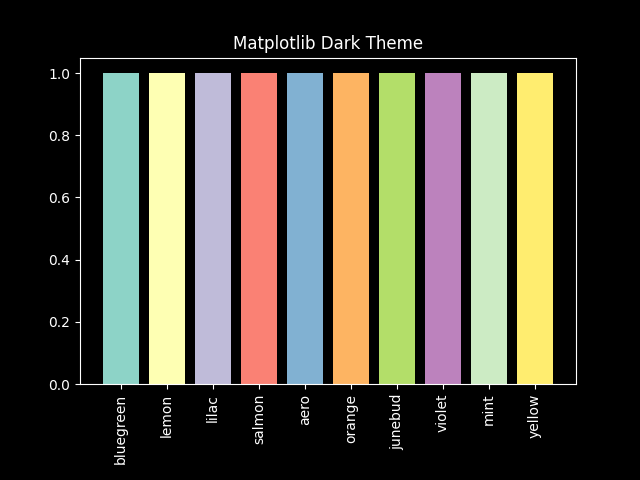

# Manually set the dark theme

```
colors_d = {
    'bluegreen': '#8dd3c7',
    'lemon': '#feffb3',
    'lilac': '#bfbbd9',
    'salmon': '#fa8174',
    'aero': '#81b1d2',
    'orange': '#fdb462',
    'junebud': '#b3de69',
    'violet': '#bc82bd',
    'mint': '#ccebc4',
    'yellow': '#ffed6f'
}
```


